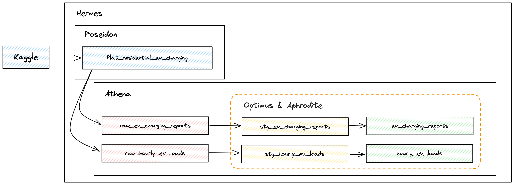

# SPC

This project is used for the Soda Certification program.

## Project Objectives

The objectives of this project are:

- Implement Soda as a Data Quality tool agains a common data product.
- Build a reference template that uses most of soda's features.
- Get certified in Soda

Additionally as personal objectives:

- Validate the implementation of Dagster in a multi-environment deployment
- Validate the implementation of a polyglot dbt project with different technologies.

## Requirements

- Python >=3.10,<3.11
- Poetry >=1.7.0
- docker
- kubectl
- minikube
- helm

## Architecure

This project is based on a medallion architecture which commonly used in data projects

All of the components of this architecture have been named, most of them based on the greek mithology:

- **Poseidon**: Storage engine used for staging data assets in its raw format before landing into a raw layer. It is based on local temporary storage and GCS for local and development environments respectively.
- **Athena**: Warehouse engine used for storing data assets as tables, composes our medallion architecture by including raw, staging and serving layers. It is based on DuckDB and BigQuery for local and development environments respectively.
- **Optimus**: Transformation engine used for manipulating the data assets and building our models while applying tests to the final datasets. It is based on dbt on all environments
- **Aphrodite**: Data quality engine used for analyzing the final result of our datasets and validate that it complies with common standards. It is based on Soda on all environments.
- **Hermes**: Orchestration engine used for communicating all of the components and data sources. It is based on Dagster on all environments.

## Data Sources

- [Kaggle: Residential EV Charging Data](https://www.kaggle.com/datasets/anshtanwar/residential-ev-chargingfrom-apartment-buildings).

## Useful commands

A list of useful commands suitable for development can be found [here](./docs/COMMANDS.md).

## Disclaimer

The data utilized in this GitHub project is not owned or generated by the developer. It may be subject to different licenses, copyrights, or restrictions. Users are responsible for verifying and complying with the terms of use associated with the data sources used within this project.
